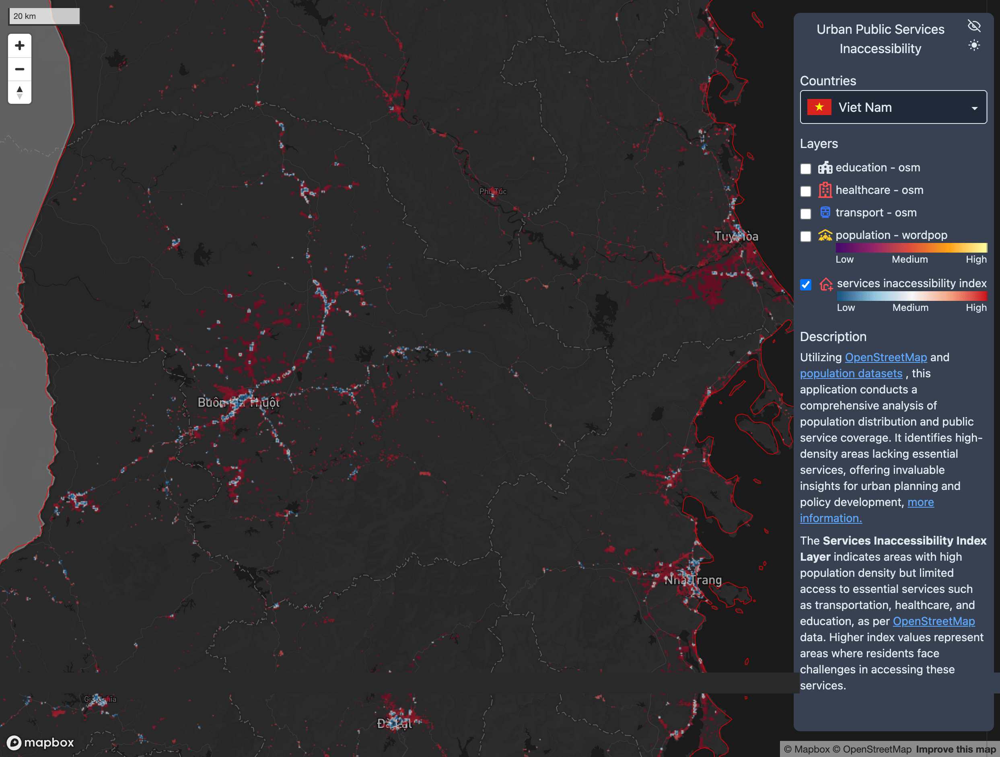

# Urban Public Services Inaccessibility

## Purpose
The goal is to identify high population density areas with limited access to essential services like transportation, healthcare, and education. This resource is designed to assist governments and stakeholders in urban planning and policy development.

## Methodology
This application assesses the coverage of public services in relation to population density to calculate an inaccessibility index. For this study, six priority countries were selected: Vietnam, Laos, Myanmar, Nepal, Afghanistan, and Pakistan.

The inaccessibility index shows areas where population density is higher but access to services is limited.

To obtain the inaccessibility index, we processed health, transportation, and education data obtained from OpenStreetMap. We applied weighting to the data groups to standardize and normalize them to values between 0 and 1. We processed population density data and normalized it to values between 0 and 1. With the normalized and weighted data, we made a comparison to find the areas with inaccessibility.

## Data Sources:

### OpenStreetMap

Data from OpenStreetMap was used to generate layers of services such as education, healthcare, and transportation. The following tags were filtered:

- **Education:** school, kindergarten, college, university, library, public_bookcase
- **Healthcare:** hospital, clinic, doctors, dentist, pharmacy, nursing_home
- **Transportation:** bus_station, ferry_terminal, fuel, parking, taxi, car_rental, bicycle_rental, bicycle_parking, charging_station, ferry_terminal, public_transport

### WorldPop

Population data was used for the density layer and the inaccessibility index.

## Key Findings

- Areas with high population density often have limited access to essential services.
- For this application, six countries and three services were selected. However, the application can be expanded to other regions and include additional services.
- It is important to note that an inaccessibility index considers many variables. For this application, we relied on data from OpenStreetMap. We must consider that the data may not be up to date and more tags should be considered.